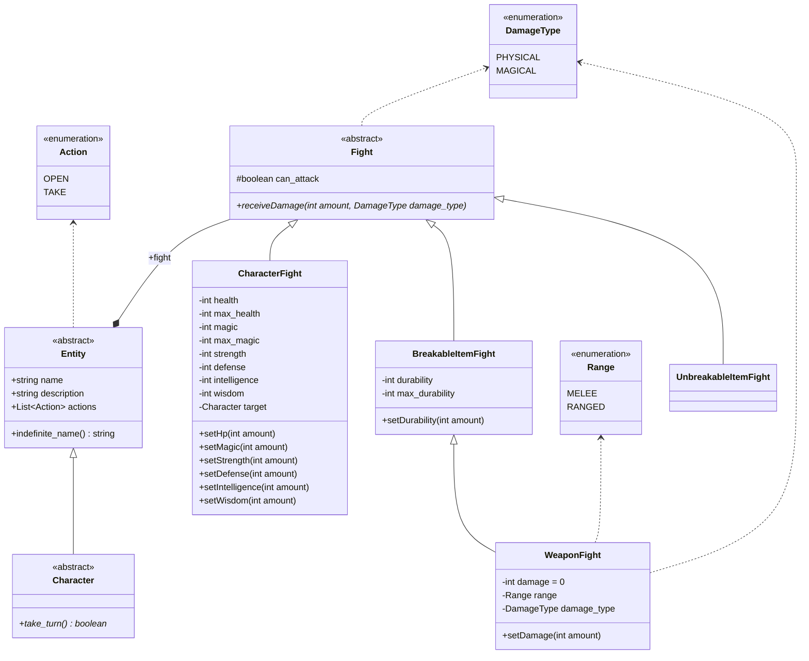
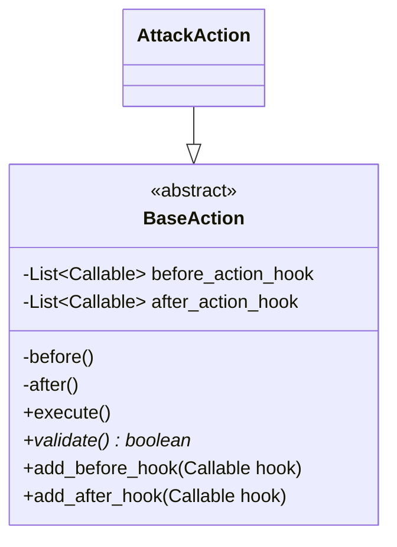
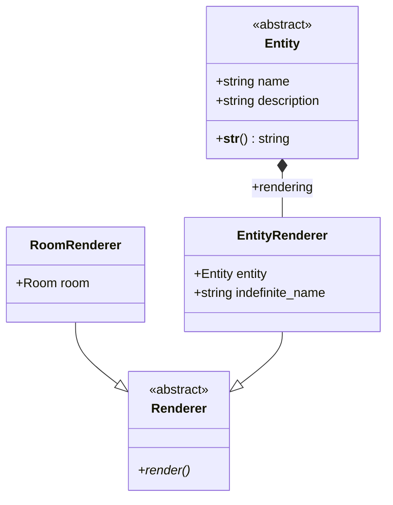

# text-adventure

text-adventure is a roguelike game written in python.

# philosophy

The game is made in such a way that different modules implements each their own logic. The game loop
will use the different modules which have been registered before the start of the game.

We must differentiate core modules and additional modules. Core modules must not (and cannot) be registered.
They define default mandatory game logic. However you can use methods provided by core modules to change
their behaviour.

List of the core modules:

- movement, responsible for :
    1. managing the `before_enter`, `after_enter`, `before_exit` and `after_exit` global hooks
    2. providing the `continue` command to go to the next room / floor
    3. providing the `hide` command ?

- entities, responsible for :
    1. providing the default entities classes
    2. providing the `factory` to create entities from dict

- generation, reponsible for :
    1. creating rooms and levels (list of rooms)
    2. providing the `room` base class

- engine, responsible for :
    1. parsing the input into commands and arguments (`parser` module)
    2. providing a `register_command` function
    3.

    The engine core module is managing the loop of the exploration into the dungeon, the `parser`
    sub-module is taking the player input and looking for the matching command, then executing
    the command with the following arguments. It contains sub-modules such qs :

    - prompt, responsible for :
        1. displaying the status of the player,
        2. managing the `before_prompt` and `after_prompt` hooks (not important)
        3. asking stuff to the user using custom prompts

- actions, responsible for :
    1. providing the basic actions for the game, such as :
        - `take` / `get`
        - `drop`

# Steps of loading a game

When the game is loaded, all modules must be imported to register the commands into the parser.

Then, before starting the engine, the generation module must be used to generate the first room.
Then, upon calling the `continue` command, the player has to chose between two rooms. Before entering
the selected room, two new rooms



```python
if not weapon.fight.can_attack:
    raise ItemCannotAttackException('...')

damage = self.strength + weapon.fight.damage
target.fight.receiveDamage(damage, weapon.fight.damage_type)


-- -- -- -- -- -- -- -- --
module: open

dungeon.current_room.entities.find(...)

if Action.OPEN not in entity.actions:
    raise ...
```




